[TOC]


# 一、HTML基本知识

## 1、标签通常是成对的

```html
<html></html>      //双标签
```

```html
<br />	//单标签
```

## 2、包含关系的标签---父子关系

```html
<head>
    <title></title>
</head>
```

---------------------------------------------------

## 3、并列关系

```html
<head></head>
<body></body>
```

## 4、标签之间的关系

```HTML
<html>    //跟标签
<head>  网址哪个部分
    <table>zzj</table>    //标题标签
</head>
<body>   //网页主体标签
    
</body>

</html>
```

## 5、基本骨架

```HTML
<html>

    <head>
        <title></title>
    </head>

    <body>
        sssss
    </body>
</html>
//按！可以一键生成基本骨架
```

## 6、开头信息的解释

### 6--1、文档类型声明

```HTML
<!DOCTYPE html>   //文档类型声明--告诉浏览器使用那个版本显示网页
//HTML5来显示的
<!DOCTYPE>       //不是HTML5的标签 是 文档类型声明标签
```

### 6--2、语言类型选择

```html
<html lang="en">   //定义文档显示的语言--这里为英文
zh-CN---中文网页
```

### 6--3、字符集

```html
//字符集是多个字符集的集合，以便计算机能够识别和储存各种文字<meta charset="UTF-8">//不写这个字符集会导致乱码
```

# 二、常用标签

## 1、标题标签：h1-h6

为了使网页更具有语义化，我们经常会在页面中用到标题标签。HTML提供了6个等级的标题

标题标签会使文字加粗变大

标题一共六级选---文字加粗一行显----由大到小依次减

```HTML
<body>    <h1>标题标签</h1>    <h1>标题一共六级选,</h1>    <h2>文字加粗一行显。</h2>    <h3>由大到小依次减，</h3>    <h4>从重到轻随之变。</h4>    <h5>语法规范书写后，</h5>    <h6>具体效果刷新见。</h6>    　　        ------zzj</body>
```

## 2、段落标签:<p></p>

用来定义段落的标签----可以将HTML文档分为任意段

文本在一个段落中会根据浏览器的大小自动换行

段落与段落有间隙

```html
 <body>       <p>我最帅我最帅我最帅我最帅我最帅我最帅我最帅我最帅我最帅我最帅我最帅我最帅我最帅我最帅我最帅我最帅我最帅我最帅我最帅我最帅我最帅我最帅我最帅我最帅我最帅我最帅我最帅我最帅我最帅我最帅我最帅我最帅我最帅我最帅我最帅我最帅我最帅我最帅我最帅我最帅我最帅我最帅我最帅我最帅我最帅我最帅我最帅</p>    <p>你最美你最美你最美你最美你最美你最美你最美你最美你最美你最美你最美你最美你最美你最美你最美你最美你最美你最美你最美你最美你最美你最美你最美你最美你最美你最美你最美你最美你最美你最美你最美你最美你最美你最美你最美你最美你最美你最美你最美你最美你最美你最美你最美你最美你最美你最美你最美</p></body>
```

## 3、换行标签:(单标签)<br/>

- 将文本强制换行
- 类似于编程里的break
- <br/>标签只是简单的开始**新的一行**，不会有段落之间的垂直间距（间隙）

```html
<body>  	<p>我最帅我最帅我最帅我最帅<br/>我最帅我最帅我最帅我最帅我最帅我最帅我最帅我最帅我最帅我最帅我最帅我最帅我最帅我最帅我最帅我最帅我最帅我最帅我最帅我最帅我最帅我最帅我最帅我最帅我最帅我最帅我最帅我最帅我最帅我最帅我最帅我最帅我最帅我最帅我最帅我最帅我最帅我最帅我最帅我最帅我最帅我最帅我最帅</p>    <p>你最美你最美你最美你最美你最美<br/>你最美你最美你最美你最美你最美你最美你最美你最美你最美你最美你最美你最美你最美你最美你最美你最美你最美你最美你最美你最美你最美你最美你最美你最美你最美你最美你最美你最美你最美你最美你最美你最美你最美你最美你最美你最美你最美你最美你最美你最美你最美你最美</p></body>
```

## 4、文本格式化标签

可以实现**粗体** *斜体* <u>下划线</u> 等等效果


| 语义   | 标签                         | 说明                 |
| ------ | ---------------------------- | -------------------- |
| 加粗   | <strong></strong>或者<b></b> | 推荐使用<strong>标签 |
| 倾斜   | <em></em>或者<i></i>         | 推荐使用<em>标签     |
| 删除线 | <del></del>或者<s></s>       | 推荐使用<del>标签    |
| 下划线 | <ins></ins>或者<u></u>       | 推荐使用<ins>标签    |

```html
 <body>    <strong>我是加粗字体</strong><br/>     <em>我是斜体</em><br/>    <del>我是删除线</del><br/>    <ins>我是下划线</ins><br/></body>
```

## 5、div 和 span 标签

他们没有语义，是**一个盒子**，是用来装内容的

div---是一个**大盒子**---**独占一行**--如下所示

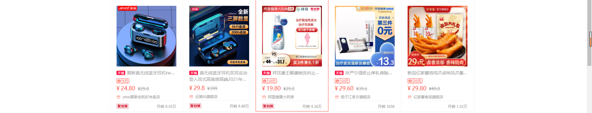

```html
    <div>我是一个div</div>123    <div>我也是一个div</div>123
```

- span---是一个**小盒子**---<u>**一行**</u>中可以放多个

```HTML
    <span>百度</span>    <span>华为</span>    <span>小米</span>
```

## 6、图像标签 img

image的缩写

src是标签的**必须属性**，它是用来**指定图像文件路径和文件名的**

一个图形标签有**多个属性**

属性之间不分前后，标签名与属性，属性与属性之间以**空格**分开

属性采用键值对的格式

图像标签的属性说明：


| 属性   | 属性值   | 说明                                       |
| ------ | -------- | ------------------------------------------ |
| src    | 图片路径 | 必须属性                                   |
| alt    | 文本     | 当图片不能显示时替换文本                   |
| title  | 文本     | 鼠标放在图像上，显示的文字                 |
| width  | 像素     | 设置图像宽度----高度和宽度修改一个即可     |
| height | 像素     | 设置图像高度----这样做的话就不会失真与压扁 |
| border | 像素     | 设置图像的边框粗细                         |

```html
<body>        <h4>当图片不能显示时替换文本</h4>        <h4>鼠标放在图像上，显示的文字</h4>        <h4>设置图像的宽高</h4>        <h4>设置边框</h4>    </body>
```

## 7、目录文件件和根目录

目录文件夹：就是普通的文件夹，用于存放想要的素材---图片，HTML文件等

**根目录：**打开目录文件夹的第一层就是根目录

## 8、路径

### 8--1、相对路径

以**引用文件的所在位置**作为参考，二建立出的目录路径--

**相对于HTML的位置**


| 相对路径的分类 | 符号 | 说明                  |
| -------------- | ---- | --------------------- |
| 同一级路径     |      | 如：src="动漫.png"    |
| 下一级路径     | /    | 如：src="img/动漫.png |
| 上一级路径     | ../  | 如：src="../动漫.png  |

### 8--2、绝对路径(不常用)

绝对路径：是指目录下的绝对位置，通常是从盘符开始的路径，或者是网络路径D:web/img/02.png 或者 http://www.itcast.cn/images/logo.gif

## 9、链接标签

### 9--1、超链接标签《a》

**作用**：从一个界面链接到另一个界面

#### 9--1.1链接的语法格式：

```html
<a href="跳转目标" target="目标窗口的弹出方式">文本或图像</a>
```

| 属性   | 作用                                                         |
| ------ | ------------------------------------------------------------ |
| href   | 用于指定链接目标的URL地址,(必须属性)                         |
| target | 用于指定连接页面的打开方式,_self为默认值,"_blank"为打开新的页面 |

#### 9--1.2链接的分类

**外部链接**：

```html
<a href="http://www.baidu.com" base target="_blank">百度</a>
```

**内部链接**：网站内部页面之间的相互链接(位于同一级的HTML文件)

```html
<a href="第一个案例.html" base target="_blank">第一个案例</a>
```

**空连接**：#表示---当还没有做好链接时使用

```HTML
<a href="#">空连接</a>
```

**下载链接**：如果href里面的地址是一个文件或者压缩包，会下载这个文件

```html
<a href="前端笔记.zip">前端笔记</a>    //文件格式为可下载文件<a href="music/IU - Blueming.flac">iu</a>
```

**网页元素链接**：在网页中的各种网页元素，如文本、图像、表格、音频、视频等都可以添加超链接。

```html
<a href="https://baike.baidu.com/item/%E6%9D%8E%E7%9F%A5%E6%81%A9/74308?fromtitle=IU&fromid=12013444&fr=aladdin" base target="_blank"></a>
```

**锚点链接**：可以帮我们快速定位到页面中的某个位置 

```html
    <a href="#live">生活</a><br/>    <h4 id="live">生活</h4>    <a href="#">返回顶部</a>      //专用的返回顶部
```

## 10、注释与特殊字符

注释：<!--wo-->

特殊字符：

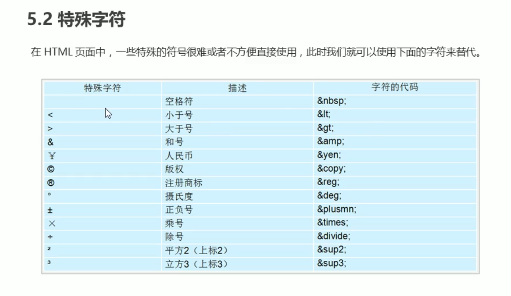

​	**重点记住**：空格、大于号、小于号

## 11、表格标签

表格的**主要作用**：用来**展示数据**的

### 	11--1、表格基本语法：

```html
   <table>        <tr>            <td>姓名</td><td>年龄</td><td>QQ飞车段位</td>        </tr>        <tr>            <td>zzj</td><td>18</td><td>车神</td>        </tr>    </table>
```

### 	11-2、表头标签：

```html
<table>        <tr>            <th>姓名</th><th>年龄</th><th>QQ飞车段位</th>        </tr> </table>
```

### 	11-3、表格的属性


```HTML
  <table border="1" cellpadding="0" align="center" cellspacing="0" width="500" height="555">     </table>
```

### 	11--3、表格结构标签：

```html
<thead></thead>    //表格头部<tbody></tbody>    //表格内容
```

### 	11--4、合并单元格

1、跨行合并(rowspan="合并单元格的个数")

```html
<th colspan="4">QQ飞车比赛</th>
```

2、跨列合并(colspan="合并单元格的个数")		

```html
 <td rowspan="3">sd</td>
```

## 12、列表标签

### 12--1、无序列表：

无序列表的各个列表项之间没有顺序级别之分的，是并序的

#### 12--1.2、规范

<ul标签内只能放<li标签-------li里面可以放任意元素---前面有几个小点

```HTML
    <ul>        <li>榴莲</li>        <li>苹果</li>        <li>香蕉</li>    </ul>
```

### 12--2、有序列表

```HTML
    <ol>        <li>sss</li>        <li>aaa</li>        <li>dddd</li>    </ol>
```

### 12--3、自定义列表：

<dl:用于定义描述列表

<dt:相当于列表头

<dd:内容

【注意】：dl里面只能有dt和dd------通常有一个dt

```HTML
   <dl>       <dt>关注我们</dt>       <dd>哔哩哔哩</dd>       <dd>qq</dd>       <dd>微信</dd>   </dl> 
```

## 13、表单标签：

目的：为了收集用户信息

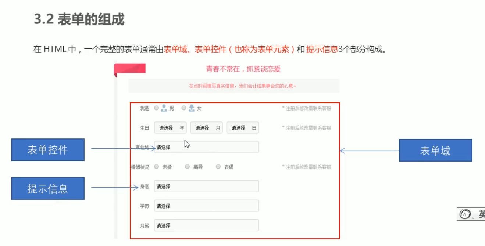

### 13--1、表单域：

概念：表单域是一个包含表单元素的区域---标签：<form----它会把它范围内的表单元素信息提交给服务器

### 13--2、表单控件(元素)

这个元素可以让用户输入信息

#### 13--2.1分类：

##### 1、input输入表单元素:

【1、用于收集用户的信息----单标签---<input type="属性值"/>

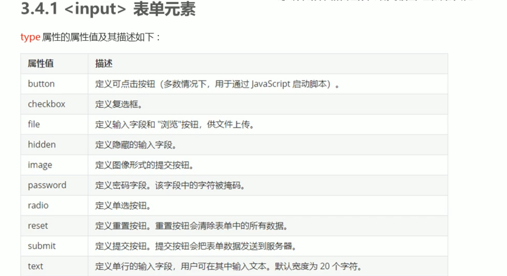

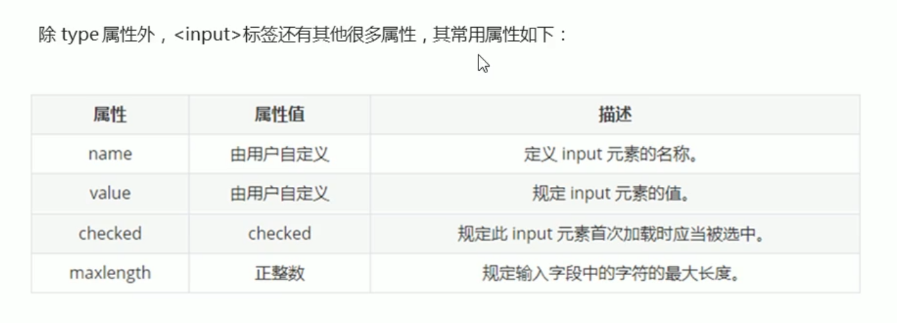	【2、**name和value是给后台传数据的**

​	【3、**单选按钮和复选框必须有name** 		

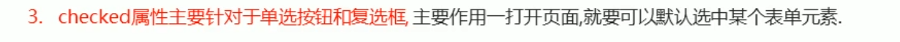

```html
    <form action="demo.go" menthod="post" name="注册界面" >        <!-- 上传文件 -->        上传头像<input type="file" ><br>        <!-- 用户名 -->        <input type="text" name="username" placeholder="用户名" maxlength="8"> <br>        <!-- 密码 -->        <input type="password" name="passworld" placeholder="请输入6-16位的密码"> <br>        <!-- 性别单选框 -->        <!-- label可以让你点击 男的 时候也可以选择按钮-->        性别：<input type="radio" name="sex" value="男" id="nan"><label for="nan">男</label>        <input type="radio" name="sex" value="女" id="nv"><label for="nv" >女</label> <br>        <!--爱好复选框-->        爱好：吃饭<input type="checkbox" name="hobby" checked="checkbox" value="吃饭">睡觉<input type="checkbox"name="hobby" value="睡觉"><br>        <!-- 可以搭配js使用 -->        <input type="button" value="获取短信验证码"><br>        <!--提交按钮 -->        <input type="submit" value="免费注册" name="submit">        <!--重置按钮 -->        <input type="reset" value="重新填写">    </form>
```

##### 2、select下拉表单元素

【1、select标签中至少包含一对option标签

【2、在option标签中定义selected="selected"时，当前项为默认项

```HTML
    <select name="籍贯" id="">        <option value="北京">北京</option>        <option value="江西" selected>江西</option>        <option value="山东">山东</option>        <option value="陕西">陕西</option>        <option value="天津">天津</option>    </select>
```

3、textarea文本域元素

【1、当用户输入的内容较多的情况下，我们就可以使用文本域

【2、通过css来指定宽度与和高度


## 14、HTML5新增的语义标签

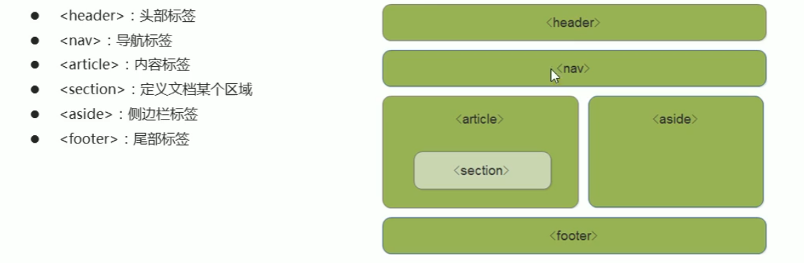


​	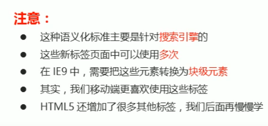

## 15、HTML5新增的媒体标签

### 	15--1、视频标签，音频标签

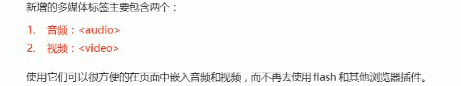

#### 		15--1--1、视频（video）

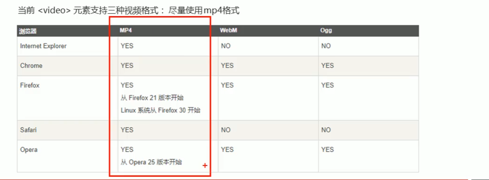

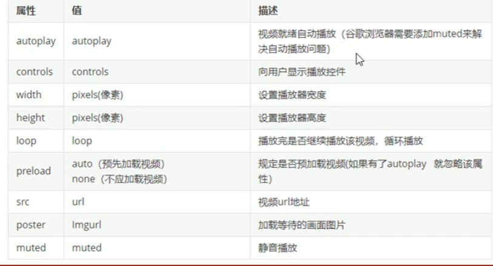

#### 		15--1--2、音频标签（audio）

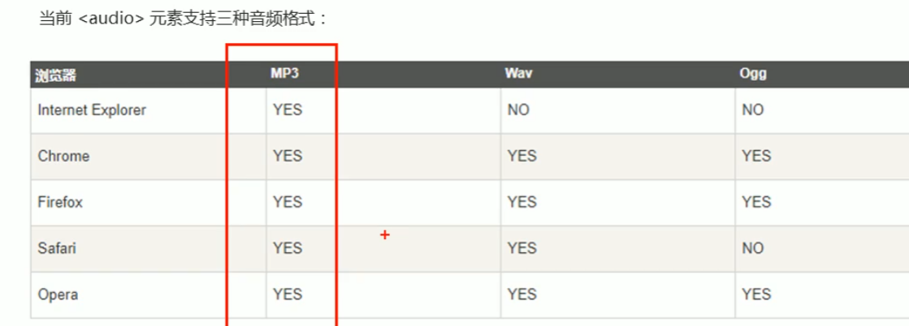

### 15--2、input新属性

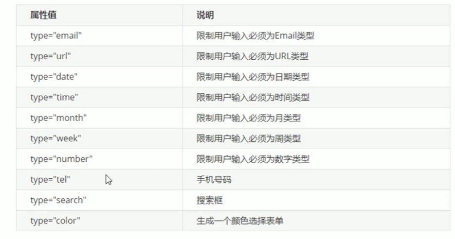

### 15--3、新增的表单属性

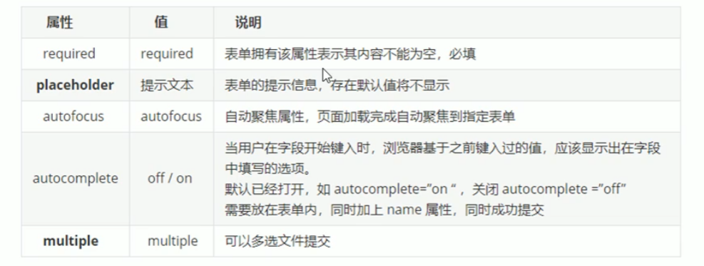

